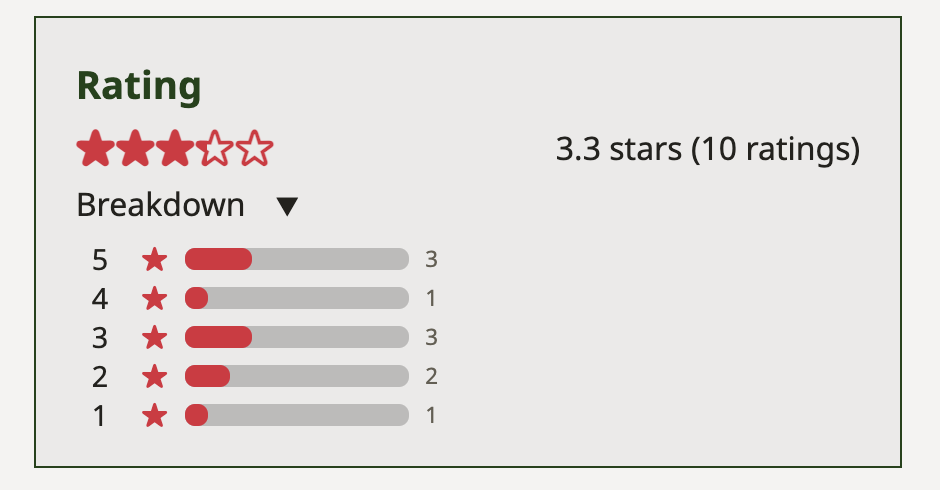

# Scrumptious Recipes

Scrumptious Recipes is a cooking website that allows users to create, share, and rate each other's recipes.

It's a full stack application that utilizes Django, HTML, CSS, and vanilla Javascript. It makes heavy use of Django's built-in templating system with various enhancements to functionality using Javascript, such as the ratings and dynamic ingredient insertion. The choice to use vanilla javascript was to more closely explore direct dom interactions as I'm already fairly experienced with React and other frameworks that abstract that away.

## Ratings

Users can assign ratings to any other user's recipes. Most CRUD operations on the site were done using Django and plain HTML forms. The ratings system was implemented using fetch requests and javascript. Additional methods were added to the recipe model to retrieve its average rating, its total number of ratings, and the ratings breakdown.

## Dynamic thumbnail generation

When users upload new recipes, they can upload any image they'd like. Thumbnails are generated on the fly using [Python Imaging Library](https://pillow.readthedocs.io/en/stable/index.html) to reduce load times on the recipe list pages.

